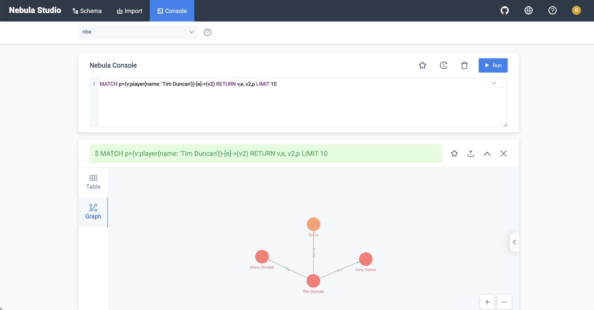
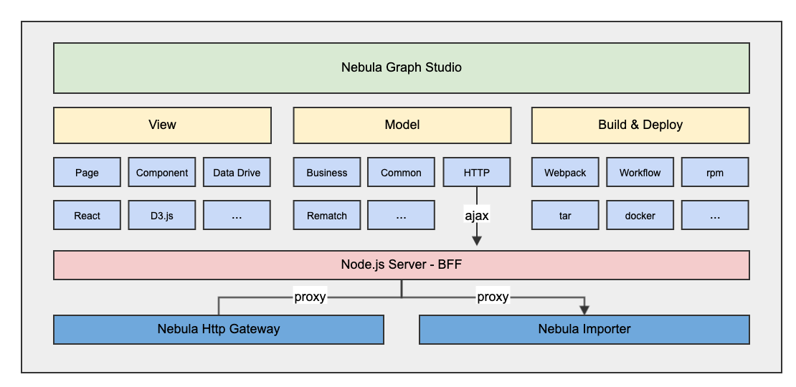

# NebulaGraph Studio
NebulaGraph Studio (Studio for short) is a web-based visualization tool for Nebula Graph. With Studio, you can create a graph schema, import data and edit nGQL statements for data queries.


## Architecture


## Version
| Nebula Graph version | NebulaGraph Studio tag | 
|----------------------|---------------------------|
| 1.x                  | v1.2.7                    |
| 2.0.x                | v2.2.x                    |
| 2.5.x                | v3.0.x                    |
| 2.6.x                | v3.1.x                    |
| 3.0.x                | v3.2.x                    |
| 3.1.x                | v3.3.x                    |
| 3.0.0 ～ 3.2.0       | v3.4.x                    |

## Development Quick Start

### set up studio and server at the same time
```
$ npm install
$ npm run dev-all
```

### Set up nebula-graph-studio only
```
$ npm install
$ npm run dev
```
### Set up go-server only
```
$ cd ./server/api/studio
$ make run
```

## Production Deploy

### 1. Build Web
```
$ npm install
$ npm run build
$ mv dist server/api/studio/assets
```

### 2. Build Server
```
$ cd server/api/studio
// update default port 9000 to 7001 in etc/studio-api.yaml first
$ go build -o server
```

### 3. Start
```
$ nohup ./server &
```

### 4. Stop Server
Use when you want shutdown the web app
```
kill -9 $(lsof -t -i :7001)
```

## Documentation 
[中文](https://docs.nebula-graph.com.cn/3.1.0/nebula-studio/about-studio/st-ug-what-is-graph-studio/)
[ENGLISH](https://docs.nebula-graph.io/3.1.0/nebula-studio/about-studio/st-ug-what-is-graph-studio/)

## Contributing
Contributions are warmly welcomed and greatly appreciated. Please see [Guide Docs](https://github.com/vesoft-inc/nebula-studio/blob/master/CONTRIBUTING.md) 
